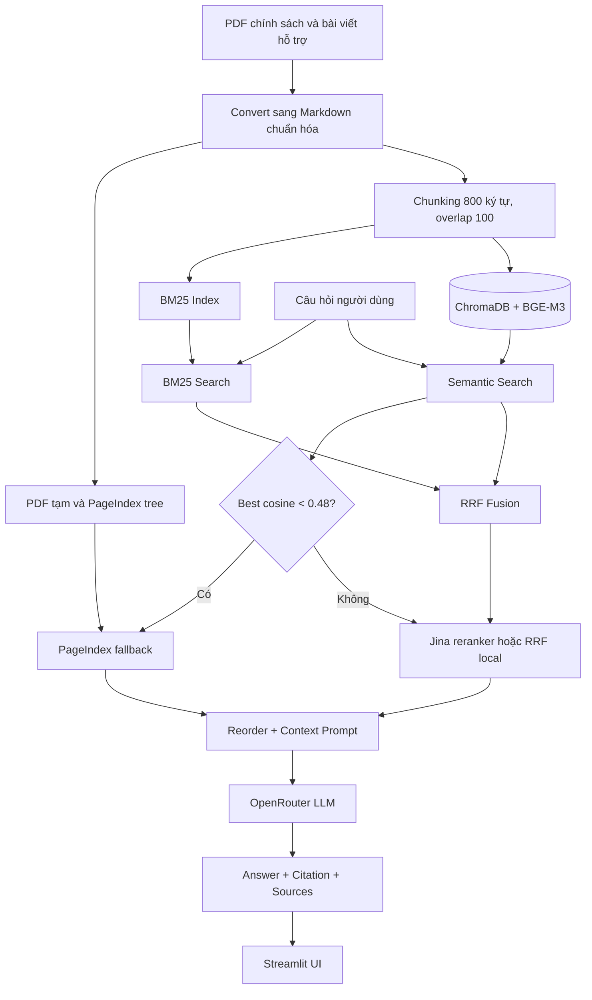

# E-commerce Support RAG Chatbot

Sản phẩm nhóm xây dựng chatbot hỏi đáp bằng tiếng Việt về chính sách thương mại
điện tử và hỗ trợ khách hàng Shopee. Hệ thống kết hợp Semantic Search, BM25,
Reciprocal Rank Fusion (RRF), PageIndex fallback và LLM generation có citation.

## Tính năng chính

- Giao diện chat Streamlit, hỗ trợ lịch sử hội thoại và câu hỏi nối tiếp.
- Hybrid retrieval: semantic search bằng `BAAI/bge-m3` kết hợp BM25.
- Hợp nhất thứ hạng bằng RRF; có thể rerank bằng Jina nếu API key hợp lệ.
- PageIndex vectorless fallback khi cosine similarity tốt nhất nhỏ hơn `0.48`.
- Sinh câu trả lời tiếng Việt có citation và hiển thị các source chunks đã dùng.
- Reorder context để giảm hiện tượng “lost in the middle”.
- Golden dataset 20 câu và pipeline RAGAS với 4 metrics, so sánh A/B hai cấu hình.

## Kiến trúc hệ thống



Điều kiện fallback luôn sử dụng **cosine score gốc** từ semantic search, không sử
dụng RRF score (`~0.016`) vì RRF chỉ phản ánh thứ hạng, không phản ánh độ liên quan
tuyệt đối.

## Cấu trúc quan trọng

```text
app.py                                  Streamlit chatbot
src/task4_chunking_indexing.py          Load, chunk và index ChromaDB
src/task5_semantic_search.py            Dense retrieval và HyDE
src/task6_lexical_search.py             BM25 retrieval
src/task7_reranking.py                  RRF, Jina reranker và MMR interface
src/task8_pageindex_vectorless.py       Upload/query PageIndex
src/task9_retrieval_pipeline.py         Pipeline retrieval hoàn chỉnh
src/task10_generation.py                Generation, memory và citation
group_project/evaluation/
  golden_dataset.json                   20 câu hỏi và đáp án chuẩn
  eval_pipeline.py                      RAGAS evaluation + A/B comparison
  results.md                            Báo cáo điểm và phân tích
```

## Công nghệ

| Thành phần | Công nghệ |
|---|---|
| UI | Streamlit |
| Embedding | Sentence Transformers `BAAI/bge-m3` |
| Vector store | ChromaDB, cosine distance |
| Sparse retrieval | `rank-bm25` |
| Fusion/reranking | RRF (`k=60`), Jina Reranker tùy chọn |
| Vectorless fallback | PageIndex Python SDK |
| Generation | OpenAI-compatible SDK qua OpenRouter |
| Evaluation | RAGAS 0.1.21, Datasets, LangChain OpenAI |

## Cài đặt

Yêu cầu Python 3.10+; khuyến nghị dùng virtual environment riêng cho dự án.

```powershell
python -m venv .venv
.\.venv\Scripts\Activate.ps1
python -m pip install --upgrade pip
python -m pip install -r requirements.txt
```

Nếu môi trường từng cài package `fpdf` 1.7.2, cần thay bằng `fpdf2`:

```powershell
python -m pip uninstall --yes fpdf
python -m pip install --force-reinstall --upgrade fpdf2
```

Tạo `.env` từ file mẫu:

```powershell
Copy-Item .env.example .env
```

Các biến môi trường:

| Biến | Bắt buộc | Mục đích |
|---|---:|---|
| `OPENROUTER_API_KEY` | Có | Generation và LLM judge của RAGAS |
| `PAGEINDEX_API_KEY` | Không | PageIndex fallback |
| `JINA_API_KEY` | Không | Cross-encoder reranking; thiếu key sẽ dùng RRF |
| `HF_TOKEN` | Không | Tăng rate limit khi tải model từ Hugging Face |
| `RAGAS_LLM_MODEL` | Không | Override model judge, mặc định `openai/gpt-4o-mini` |
| `RAGAS_EMBEDDING_MODEL` | Không | Override embedding judge, mặc định `BAAI/bge-m3` |

Không commit file `.env` hoặc API key lên repository.

## Chuẩn bị dữ liệu

Nếu ChromaDB chưa được tạo hoặc corpus đã thay đổi, chạy:

```powershell
python -m src.task4_chunking_indexing
```

PageIndex là tùy chọn. Để kích hoạt fallback thật sự, upload/index tài liệu một lần:

```powershell
python -m src.task8_pageindex_vectorless
```

Lệnh này chuyển Markdown sang PDF Unicode, upload tài liệu, chờ trạng thái
`retrieval_ready` và tạo cache `pageindex_doc_ids.json`. Có API key nhưng chưa có
cache này thì Task 9 chưa thể trả kết quả PageIndex.

## Chạy chatbot

Từ thư mục gốc repository:

```powershell
$env:PYTHONIOENCODING="utf-8"
streamlit run app.py
```

Mở URL Streamlit hiển thị trong terminal, thường là `http://localhost:8501`.

## Chạy kiểm thử

```powershell
python -m pytest tests -v
```

Một số test tích hợp cần ChromaDB/model đã sẵn sàng; test PageIndex có thể cần API
key và cache tài liệu.

## RAG Evaluation

Nhóm chọn **RAGAS 0.1.21** và đánh giá bốn metrics:

1. Faithfulness
2. Answer Relevance
3. Context Recall
4. Context Precision

Hai cấu hình A/B:

| Cấu hình | Retrieval | Reranking | Fallback |
|---|---|---|---|
| `hybrid_rerank` | Semantic + BM25 + RRF | Bật | PageIndex bật |
| `dense_only` | Semantic only | Tắt | Tắt |

Chạy thử hai câu để kiểm tra dependency và API quota:

```powershell
$env:PYTHONIOENCODING="utf-8"
$env:JINA_API_KEY=""
python -m group_project.evaluation.eval_pipeline --limit 2
```

Chạy đủ 20 câu cho cả hai cấu hình:

```powershell
$env:PYTHONIOENCODING="utf-8"
$env:JINA_API_KEY=""
python -m group_project.evaluation.eval_pipeline
```

Để dùng Jina thay vì RRF local, bỏ dòng đặt `JINA_API_KEY` rỗng và bảo đảm key hợp
lệ. Full evaluation phát sinh nhiều request tới LLM; cần kiểm tra OpenRouter quota
trước khi chạy. Báo cáo được ghi vào [evaluation/results.md](evaluation/results.md).

### Kết quả hiện có

| Metric | `hybrid_rerank` | `dense_only` | Δ |
|---|---:|---:|---:|
| Faithfulness | 0.879 | 0.913 | -0.034 |
| Answer Relevance | 0.717 | 0.715 | 0.002 |
| Context Recall | 1.000 | 1.000 | 0.000 |
| Context Precision | 0.990 | 0.990 | -0.000 |
| Average | 0.896 | 0.905 | -0.008 |

Dense-only chiếm ưu thế trên bộ kiểm thử. Nguyên nhân chính: BM25 gây ra noise
cho văn bản tiếng Việt, và fallback PageIndex thêm context ít liên quan. Chi tiết
xem [group_project/evaluation/results.md](group_project/evaluation/results.md).

## Deliverables

- [x] `evaluation/golden_dataset.json` — 20 cặp question/expected answer/context đa dạng.
- [x] `evaluation/eval_pipeline.py` — pipeline RAGAS bốn metrics.
- [x] So sánh A/B `hybrid_rerank` và `dense_only`.
- [x] `evaluation/results.md` — bảng điểm, worst performers và recommendations.
- [x] Streamlit chatbot có citation, source display và conversation memory.
- [x] Xác nhận lại full RAGAS run — kết quả mới tại `evaluation/results.md`.
- [ ] Xác nhận PageIndex upload/query end-to-end với cache tài liệu hiện hành.

## Phân công công việc

| Thành viên | MSSV | Nhiệm vụ | Trạng thái |
|---|---|---|---|
| Đặng Văn Nhân | 2A202601050 | Quản lý chung, tích hợp pipeline và Task 9 | Đã tích hợp |
| Nguyễn Trần Gia Phụng | 2A202601286 | Task 1–3, Task 4, Task 5 và HyDE | Đã tích hợp |
| Giáp Hoàng Thịnh | 2A202601492 | Task 6, Task 7 và Task 8 | Đã tích hợp |
| Trần Bá Lợi | 2A202601316 | Streamlit `app.py` và Task 10 | Đã tích hợp |
| Nguyễn Trương Ngọc Mai | 2A202601652 | Golden dataset, RAGAS và báo cáo A/B | Đã tích hợp; full rerun phụ thuộc API quota |

## Lưu ý vận hành

- Nếu Jina trả HTTP 401/403/402/429, xóa hoặc để trống `JINA_API_KEY`; pipeline sẽ
  tự fallback về RRF.
- Trên Windows nên đặt `PYTHONIOENCODING=utf-8` để tránh lỗi CP1252 khi in tiếng Việt
  hoặc biểu tượng cảnh báo.
- PageIndex dùng Retrieval API legacy của SDK hiện tại; `submit_document`, `get_tree`,
  `submit_query` và `get_retrieval` cần đồng bộ với phiên bản SDK được cài.
- Không dùng RRF score để quyết định PageIndex fallback; điều kiện đúng là cosine gốc
  từ `dense_results[0]["score"] < 0.48`.

Repo có thể tiếp tục được mở rộng ở giai đoạn sau bằng query expansion, reranker ổn
định hơn, evaluation artifact theo từng case và knowledge graph retrieval.
