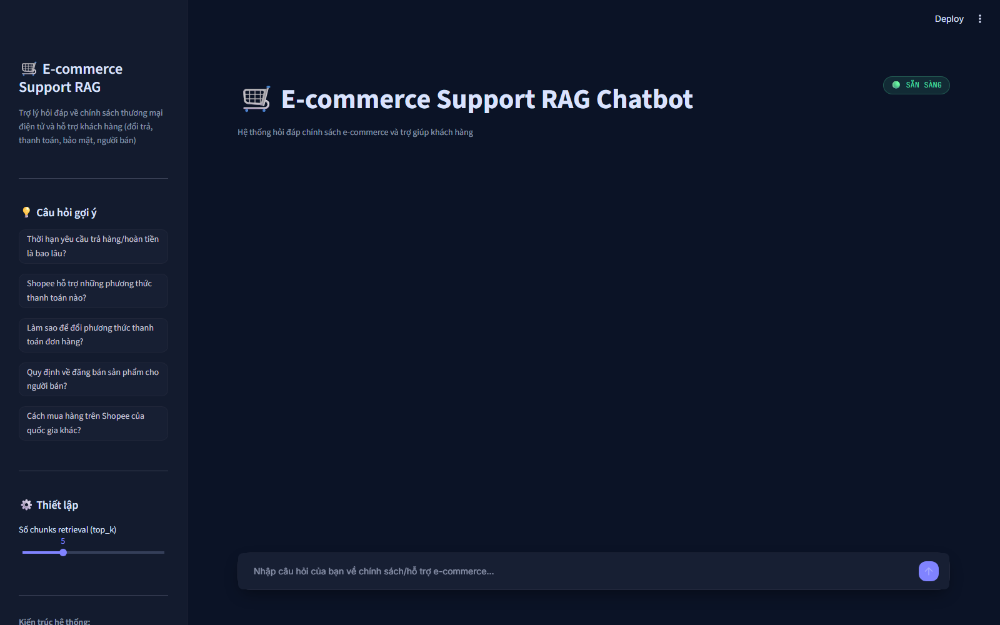
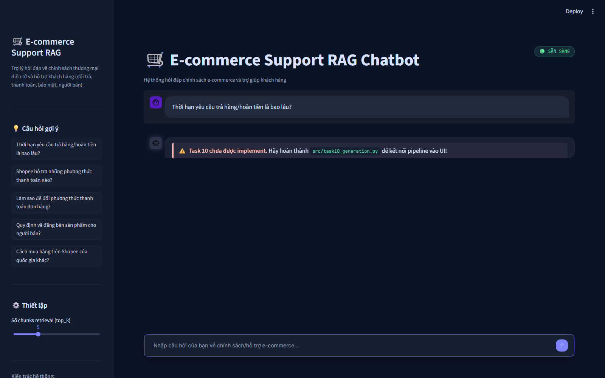

# Frontend Review — E-commerce Support RAG Chatbot

Phạm vi: `app.py` (Streamlit chatbot UI) + `src/task10_generation.py` (Generation có Citation).
Role phụ trách: **Role 4 — Frontend & Chatbot Developer** (Phương Án B, nhóm 5 người).

---

## 1. Tổng quan

Chatbot Streamlit hỏi-đáp chính sách thương mại điện tử (đổi trả, thanh toán, quy định người bán...),
trả lời có trích dẫn nguồn, hỗ trợ hội thoại nhiều lượt (follow-up). Giao diện được thiết kế lại theo
[`design/stitch_streamlit_ui_enhancement/DESIGN.md`](../../design/stitch_streamlit_ui_enhancement/DESIGN.md)
— dark mode, tông Indigo/Violet, glassmorphism.

## 2. Luồng dữ liệu

```
app.py (Streamlit UI)
  │  query, top_k (slider), chat_history (session_state.messages)
  ▼
generate_with_citation()        [src/task10_generation.py]
  │
  ├─ retrieve(query, top_k)     [src/task9_retrieval_pipeline.py]
  │     └─ semantic_search + lexical_search + rerank_rrf + PageIndex fallback
  │
  ├─ reorder_for_llm(chunks)    chống "lost in the middle": best → worst → 2nd-best
  ├─ format_context(chunks)     gắn nhãn [Document i | Source | Type] cho từng chunk
  └─ gọi OpenRouter (LLM_MODEL) với system prompt bắt buộc trích dẫn
        │
        ▼
  {'answer', 'sources', 'retrieval_source'}
        │
        ▼
  app.py hiển thị: câu trả lời + badge nguồn (hybrid/pageindex) + mini-card nguồn có highlight
```

Schema chunk cố định xuyên suốt pipeline:
```python
{'content': str, 'score': float, 'metadata': {'source': str, 'type': str, 'chunk_index': int}, 'source': str}
```

## 3. Đã hoàn thành

### Task 10 — `src/task10_generation.py`
| Hàm | Trạng thái | Ghi chú |
|---|---|---|
| `reorder_for_llm()` | ✅ | `front = chunks[::2]`, `back đảo = chunks[1::2][::-1]` |
| `format_context()` | ✅ | Nhãn `[Document i \| Source: ... \| Type: ...]` |
| `generate_with_citation()` | ✅ | Gọi OpenRouter, nhận `chat_history` và chỉ gửi tối đa `MAX_HISTORY_TURNS=3` lượt gần nhất |

Model hiện được cấu hình: `openai/gpt-4o-mini` qua OpenRouter.

### `app.py` — Streamlit UI
- Sidebar: brand header, 5 câu hỏi gợi ý dạng chip, slider `top_k` (3-10), nút **"➕ Cuộc trò chuyện mới"**.
- Header: status pill tự động (🟢 SẴN SÀNG / 🟡 CHƯA CÓ OPENROUTER KEY). Trạng thái chỉ dựa trên `OPENROUTER_API_KEY`, đúng với provider mà Task 10 đang gọi.
- Chat area: bong bóng chat bo góc, avatar riêng user/assistant, khung cảnh báo lỗi viền đỏ trái.
- Mỗi câu trả lời kèm:
  - **Badge nguồn retrieval** (🟢 Hybrid Search / 🟠 PageIndex Fallback) — đọc field `retrieval_source` trước đây bị bỏ qua.
  - **Mini-card nguồn trích dẫn** — icon theo loại tài liệu (📄 legal / 📰 news), score, và **highlight từ khoá** trùng khớp câu hỏi trong đoạn trích.
- **Conversation memory**: lịch sử hội thoại (`session_state.messages`) được truyền vào `generate_with_citation(..., chat_history=...)`. Task 10 lọc role hợp lệ và giới hạn 3 lượt gần nhất trước khi gửi tới LLM; lịch sử chỉ hỗ trợ hiểu câu hỏi follow-up, còn câu trả lời vẫn phải dựa trên context retrieval hiện tại.
- Theme: `.streamlit/config.toml` + CSS injected tái tạo bản design (font Inter/JetBrains Mono, glass panel, rounded corners, floating input).

### Đã fix chung (không riêng frontend nhưng cần để chạy được)
- `requirements.txt`: gỡ xung đột dependency `ragas==0.1.21` (ghim `langchain-core<0.3`) → nâng lên `ragas>=0.2.15,<0.5.0`.

## 4. Kiểm thử

```powershell
python -m pytest tests/test_individual.py tests/test_task10_chat_history.py -k "Task10 or chat_history" -v
```
```
test_format_context_includes_source   PASSED
test_reorder_function_exists          PASSED
test_generate_returns_dict_with_answer PASSED hoặc SKIPPED nếu môi trường thiếu API key/model
```

- Unit test xác nhận `reorder_for_llm()` và `format_context()` hoạt động.
- Contract giữa UI và Task 10 đã đồng bộ: `generate_with_citation(query, top_k, chat_history)`.
- `tests/test_task10_chat_history.py` mock `retrieve()` và OpenRouter client để xác nhận chỉ 3 lượt hợp lệ gần nhất được gửi tới LLM, không phụ thuộc mạng/API key.
- Chạy `streamlit run app.py` thật + chụp màn hình bằng Playwright, so khớp với `screen.png` gốc trong bản design
  (xem ảnh bên dưới).
- Kết quả test phụ thuộc việc môi trường đã có embedding model và API key hay chưa; các test tích hợp có thể được skip khi dependency ngoài chưa sẵn sàng.

### Ảnh chụp thực tế

| Màn hình chính | Ảnh trạng thái lỗi từ bản frontend cũ |
|---|---|
|  |  |

## 5. Giới hạn hiện tại / việc còn lại

- Câu trả lời end-to-end cần `OPENROUTER_API_KEY` hợp lệ và các dependency/model retrieval đã sẵn sàng trong môi trường chạy.
- Retrieval cho câu hỏi follow-up vẫn lấy query hiện tại làm đầu vào. Lịch sử giúp LLM hiểu ngữ cảnh hội thoại nhưng chưa có bước rewrite query chuyên biệt trước retrieval.
- **Deploy online** (bonus 4đ) — chưa làm, cần tài khoản Streamlit Community Cloud / HF Spaces.
- **Kiến trúc diagram cho `group_project/README.md`** (3đ, việc chung) — chưa vẽ.

## 6. Cách chạy Frontend

### Bước 1 — Setup môi trường (nếu chưa làm ở CP0)
```powershell
python -m venv .venv
.venv\Scripts\Activate.ps1
pip install -r requirements.txt
```

### Bước 2 — Khai báo API key
```powershell
copy .env.example .env
```
Mở `.env`, điền tối thiểu:
```
OPENROUTER_API_KEY=sk-or-v1-...
```
(Lấy free tại https://openrouter.ai — không bắt buộc trả phí, có model `:free`.)

### Bước 3 — (Khuyến khích) tải trước embedding model
Tránh Streamlit bị treo lúc demo do tự tải model ~2.2GB giữa chừng:
```powershell
python -c "from sentence_transformers import SentenceTransformer; SentenceTransformer('BAAI/bge-m3')"
```

### Bước 4 — Chạy app
```powershell
streamlit run app.py
```
Mở trình duyệt tại `http://localhost:8501`.

### Trạng thái mong đợi hiện tại
Khi có `OPENROUTER_API_KEY` hợp lệ, ứng dụng gọi retrieval và generation để hiển thị câu trả lời kèm citation, badge nguồn và mini-card trích dẫn. Nếu thiếu key, header hiển thị **"CHƯA CÓ OPENROUTER KEY"** và lỗi cấu hình được trình bày trong khung cảnh báo khi gửi câu hỏi.

### Test nhanh không gọi retrieval/LLM thật (dùng mock)
Có thể dùng `unittest.mock.patch("src.task10_generation.retrieve", return_value=<list chunk giả>)` và mock `openai.OpenAI` để test `generate_with_citation()` mà không phụ thuộc model, mạng hoặc API key.
